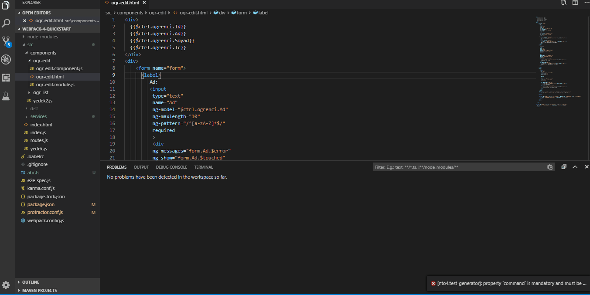

# VsCodeTestGenerator


[](https://eksisozluk.com) [](https://raw.githubusercontent.com/karanba/VSCode-TortoiseHg-Commands/master/LICENSE) [](https://github.com/nto4/VsCodeTestGenerator) [](https://github.com/nto4/VsCodeTestGenerator/issues) 


## Overview

This extension is create a template for e2e test writing for angularjs using  protractor

## Installation

```
installation comand will come
```

# Features
Following command is avalible in explorer/context, editor/context and editor/title/context menus.
 
* Right-click the file for which you want to create a test and click Generate Test


## Available Commands
* Generate Test

# Demo 

TortoiseHg must be installed in your local and thg.exe must be in your path.

 


# Feedback & Contributing

 * Please report any bugs, suggestions or documentation requests via the [Github issues](https://github.com/nto4/VsCodeTestGenerator/issues).
 * Feel free to submit [pull requests](https://github.com/nto4/VsCodeTestGenerator/pulls).